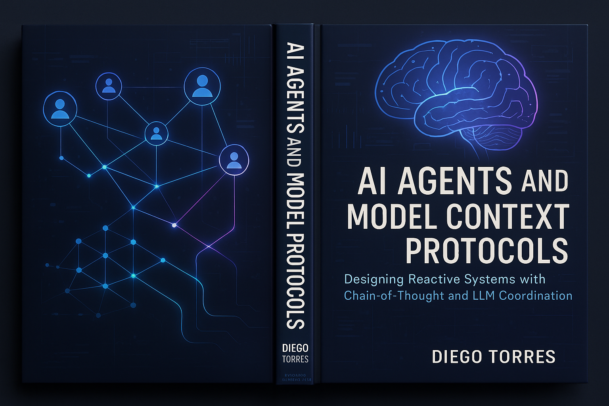

# Building Multi-Agent AI Systems Book



A comprehensive guide to building multi-agent AI systems, including practical implementations and theoretical foundations, accompanied by runnable code examples.

## Project Structure

```
Building_Multi_Agent_AI_Systems_Book/
├── .gitignore          # Git ignore file
├── README.md           # This file
├── requirements.txt    # Python dependencies
├── chapters/           # Book chapters in Markdown format (e.g., chapter_01.md)
├── images/             # Diagrams and illustrations (Optional)
└── code/
    ├── backend/        # FastAPI backend with in-memory storage
    │   └── main.py     # Backend API server with WebSocket support
    ├── frontend/       # Basic HTML/CSS/Bootstrap UI
    │   └── index.html  # Simple dashboard UI
    ├── mcp_server/     # Model Context Protocol server (runs via stdio)
    │   └── server.py   # MCP server implementation
    └── mcp_client/     # MCP client implementation (for testing the server)
        └── client.py   # Script to test MCP server
```

## Setup and Running

**Prerequisites:**
*   Python 3.10+
*   `pip` (or preferably `uv` for environment management)

**Setup:**

1.  **Clone the repository:**
    ```bash
    git clone <your-repo-url> # Replace with your GitHub repo URL
    cd Building_Multi_Agent_AI_Systems_Book
    ```
2.  **(Recommended) Create and activate a virtual environment:**
    Using `uv`:
    ```bash
    uv venv
    source .venv/bin/activate # Linux/macOS
    # .venv\Scripts\activate # Windows
    ```
    Or using standard `venv`:
    ```bash
    python -m venv .venv
    source .venv/bin/activate # Linux/macOS
    # .venv\Scripts\activate # Windows
    ```
3.  **Install dependencies:**
    ```bash
    pip install -r requirements.txt
    # or uv pip install -r requirements.txt
    ```

**Running Components:**

1.  **Run the Backend Server:**
    Open a terminal, navigate to the backend directory, and run:
    ```bash
    cd code/backend
    uvicorn main:app --reload --port 8001 # Using port 8001 to avoid conflict with frontend
    ```
    You can access the API docs at `http://localhost:8001/docs`.

2.  **Run the Frontend:**
    Open *another* terminal, navigate to the frontend directory, and run a simple HTTP server:
    ```bash
    cd code/frontend
    python -m http.server 8000
    ```
    Open your browser to `http://localhost:8000`.

3.  **Test the MCP Server:**
    Open *another* terminal and run the MCP client script. It will automatically start the MCP server as a subprocess.
    ```bash
    python code/mcp_client/client.py
    ```
    Observe the output showing interaction with the MCP server.

## Core Dependencies

*   **Python 3.10+**
*   **FastAPI**: For the backend web API and WebSocket support.
*   **Uvicorn**: ASGI server to run FastAPI.
*   **mcp**: The Model Context Protocol library for server/client implementation.
*   **Bootstrap 5**: For basic frontend styling.

## Project Components Overview

### Backend (`code/backend`)
*   Provides a RESTful API and WebSocket endpoints (built with FastAPI) for agent management and real-time communication.
*   Uses in-memory storage for simplicity and fast access.
*   Implements endpoints for agent management, messaging, and system metrics.
*   Features WebSocket support for real-time chat functionality.
*   Includes role-based response generation for different agent types.

### Frontend (`code/frontend`)
*   A very basic HTML/CSS/JS frontend using Bootstrap.
*   `index.html` shows sections for visualizing agents, tools, memory, and decisions.
*   Implements WebSocket-based chat interface for real-time agent communication.
*   Displays system metrics and agent status.

### MCP Server (`code/mcp_server`)
*   Implements an MCP server using the `mcp` library.
*   Communicates via standard input/output (`stdio`).
*   Exposes dummy tools (`web_search`, `