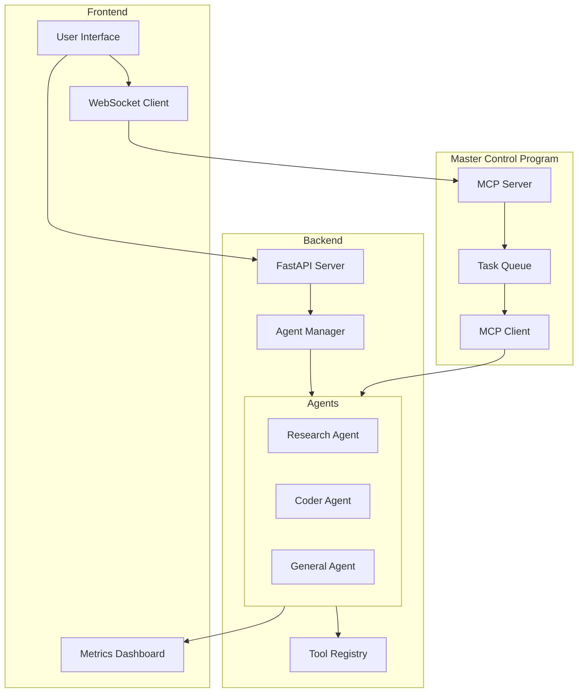
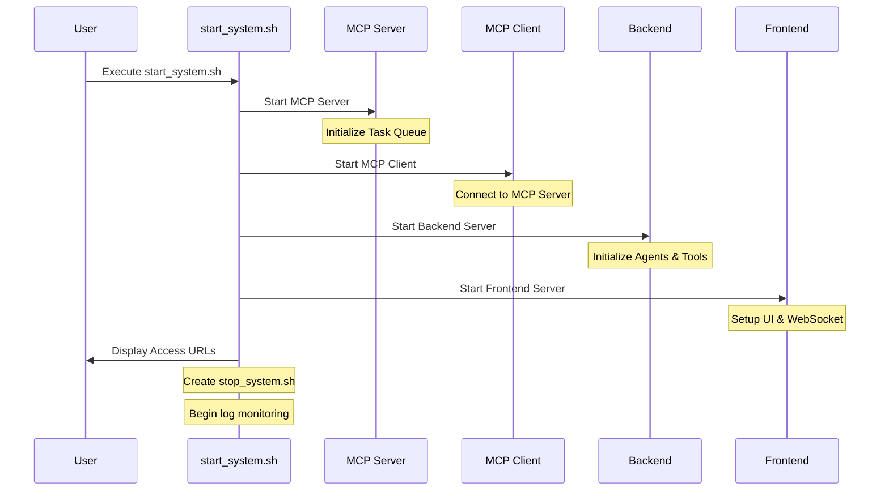

# Multi-Agent AI Systems Guide

A comprehensive guide and implementation for building multi-agent AI systems. This project includes both the theoretical documentation and a practical implementation of a multi-agent system.

## Project Structure

```
.
├── chapters/           # Documentation chapters
├── code/              # Implementation code
│   ├── backend/       # FastAPI backend
│   └── frontend/      # Frontend application
│   └── tests/         # Test suites
└── README.md          # This file
```

## System Architecture



## Startup Process



## Component Communication

```mermaid
flowchart LR
    subgraph User Interface
        Chat[Chat Interface]
        Status[Status Display]
    end

    subgraph Agent System
        RA[Research Agent]
        CA[Coder Agent]
        Tools[Tool Registry]
    end

    subgraph Processing
        Val[Input Validation]
        Safety[Safety Checks]
        History[Chat History]
    end

    Chat -->|User Input| Val
    Val -->|Validated| Safety
    Safety -->|Safe Input| Agent System
    Agent System -->|Using| Tools
    Agent System -->|Response| History
    History -->|Update| Status
    Status -->|Display| Chat
```

## Backend Implementation

The backend is built with FastAPI and provides a RESTful API for interacting with AI agents. It includes:

- Multiple agent types (Research Assistant, Code Helper, Writing Assistant)
- Real-time communication via WebSockets
- Chain of Thought reasoning
- System metrics and monitoring
- CORS support for multiple frontend origins

### Available Endpoints

- `GET /api/agents` - List all available agents
- `GET /api/agents/{agent_id}` - Get specific agent details
- `POST /api/agents/{agent_id}/chat` - Chat with a specific agent
- `GET /api/metrics` - Get system metrics
- `WebSocket /ws/{agent_id}` - Real-time communication with agents

### Running the Backend

1. Navigate to the backend directory:
   ```bash
   cd code/backend
   ```

2. Install dependencies:
   ```bash
   pip install -r requirements.txt
   ```

3. Start the server:
   ```bash
   python main.py
   ```

The server will start on `http://localhost:5000`. You can access the API documentation at `http://localhost:5000/docs`.

### Testing the API

You can test the endpoints using curl:

```bash
# List all agents
curl http://localhost:5000/api/agents

# Get specific agent
curl http://localhost:5000/api/agents/1

# Chat with an agent
curl -X POST http://localhost:5000/api/agents/1/chat \
  -H "Content-Type: application/json" \
  -d '{"content": "Hello, can you help me with research?"}'

# Get system metrics
curl http://localhost:5000/api/metrics
```

## Frontend Implementation

The frontend provides a user interface for interacting with the agents. It includes:

- Agent selection interface
- Real-time chat functionality
- Visualization of agent reasoning steps
- System metrics dashboard

### Running the Frontend

1. Navigate to the frontend directory:
   ```bash
   cd code/frontend
   ```

2. Install dependencies:
   ```bash
   npm install
   ```

3. Start the development server:
   ```bash
   npm run dev
   ```

The frontend will be available at `http://localhost:3000`.

## Documentation

The `chapters/` directory contains detailed documentation about:

- Chain of Thought (CoT) Reasoning
- The ReAct Paradigm
- Cloud API & Deployment Strategies
- Multi-Agent Communication Protocols
- Implementation Best Practices

## Testing Infrastructure

The project includes comprehensive test suites for all major components:

### Core Test Suites

1. **Agent Processors Tests**
   - Research processor validation
   - Code processor safety checks
   - API integration testing
   - Error handling verification

2. **Safety Guardrails Tests**
   - Code safety validation
   - Tool usage permissions
   - Resource limit monitoring
   - Content safety checks
   - Metrics integration

3. **Agent Orchestration Tests**
   - Message processing validation
   - Tool request handling
   - Agent handoff management
   - Resource usage monitoring
   - Timeout handling

### Running Tests

1. Install test dependencies:
   ```bash
   pip install pytest pytest-asyncio
   npm install jest @jest/globals
   ```

2. Run backend tests:
   ```bash
   cd code/backend
   pytest tests/
   ```

3. Run frontend tests:
   ```bash
   cd code/frontend
   npm test
   ```

### Test Coverage Areas

- **Functionality Testing**
  - UI interactions
  - Form submissions
  - Data display
  - Error handling
  - Token counting
  - Metrics tracking
  - Real-time updates

- **Regression Testing**
  - UI consistency
  - API compatibility
  - Backward compatibility

- **Safety Testing**
  - Code execution safety
  - Resource limits
  - Content filtering
  - Tool usage permissions

## Development Guidelines

### Testing Guidelines

1. **Writing Tests**
   - Write tests for all new features
   - Include both positive and negative test cases
   - Mock external dependencies
   - Test error handling paths

2. **Test Organization**
   - Group tests by functionality
   - Use descriptive test names
   - Maintain test isolation
   - Clean up test resources

3. **Continuous Integration**
   - All tests must pass before merging
   - Maintain test coverage above 80%
   - Address test failures promptly
   - Regular test suite maintenance

## Contributing

Contributions are welcome! Please feel free to submit a Pull Request.

## License

This project is licensed under the MIT License - see the LICENSE file for details.