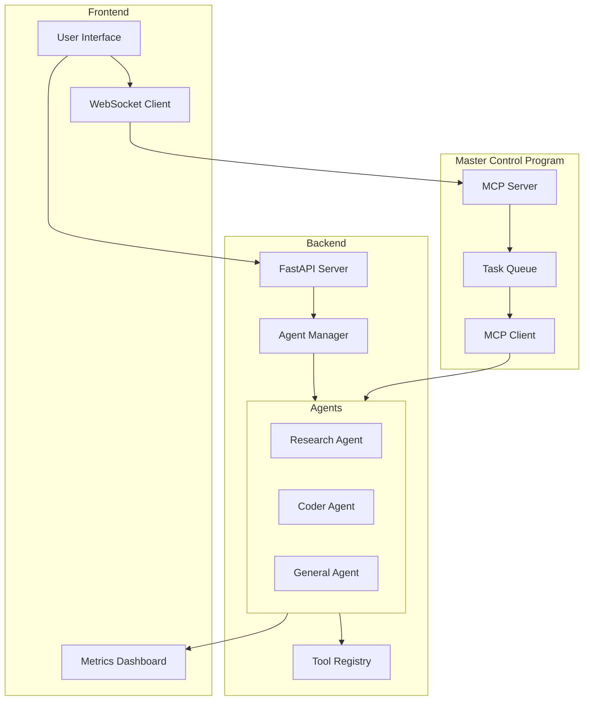
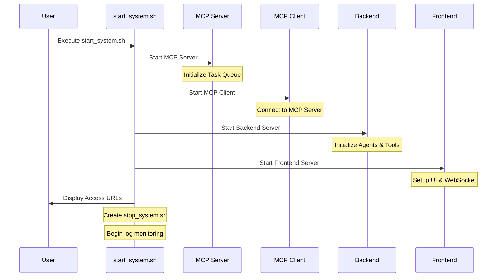

# Chapter 1: Introduction to Multi-Agent AI Systems

## System Overview

This guide presents a comprehensive approach to building multi-agent AI systems, combining theoretical foundations with practical implementation. The system architecture is designed to be modular, scalable, and secure, with clear separation of concerns between different components.

## System Architecture



### Key Components

1. **Frontend Layer**
   - Modern web interface for user interactions
   - Real-time WebSocket communication
   - Metrics visualization dashboard
   - Responsive design for multiple devices

2. **Backend Layer**
   - FastAPI server for REST endpoints
   - Agent Manager for orchestration
   - Tool Registry for agent capabilities
   - Specialized agents for different tasks

3. **Master Control Program (MCP)**
   - Central task coordination
   - Load balancing
   - System monitoring
   - Resource management

## System Startup Process



## Component Communication

```mermaid
flowchart LR
    subgraph User Interface
        Chat[Chat Interface]
        Status[Status Display]
    end

    subgraph Agent System
        RA[Research Agent]
        CA[Coder Agent]
        Tools[Tool Registry]
    end

    subgraph Processing
        Val[Input Validation]
        Safety[Safety Checks]
        History[Chat History]
    end

    Chat -->|User Input| Val
    Val -->|Validated| Safety
    Safety -->|Safe Input| Agent System
    Agent System -->|Using| Tools
    Agent System -->|Response| History
    History -->|Update| Status
    Status -->|Display| Chat
```

### Communication Flow

1. **User Input Processing**
   - Input validation and sanitization
   - Safety checks and content filtering
   - History management and context tracking

2. **Agent Processing**
   - Task distribution to specialized agents
   - Tool access and execution
   - Response generation and validation

3. **Output Handling**
   - Response formatting
   - History updates
   - UI state management

## Getting Started

The system can be started using the provided `start_system.sh` script, which initializes all components in the correct order and establishes necessary connections. The script also creates a corresponding `stop_system.sh` for graceful system shutdown.

## Introduction

Multi-agent AI systems represent a revolutionary paradigm in artificial intelligence, combining the cognitive capabilities of large language models with specialized tools and coordination mechanisms to create powerful, autonomous applications capable of solving complex problems. This chapter introduces the foundational concepts necessary to understand these systems and their potential.

## 🤖 AI Agents & Agent Architectures

The landscape of artificial intelligence is rapidly evolving, with AI agents emerging as sophisticated software systems designed to autonomously pursue goals and complete tasks on behalf of users. [1] These agents exhibit key characteristics such as the ability to reason, plan strategically, retain information through memory, and possess a level of independence in making decisions, learning from experiences, and adapting to new situations. [1] The power behind these capabilities largely stems from the multimodal capacity of generative AI and AI foundation models, allowing agents to process various forms of information like text, voice, video, audio, and code simultaneously, enabling them to converse, reason, learn, and make decisions. [1] Unlike traditional AI assistants that primarily respond to user-initiated requests and often recommend actions with the final decision resting with the user, AI agents can proactively perform complex, multi-step actions with a higher degree of autonomy. [1] This distinction highlights a significant shift towards systems that can operate more independently to achieve desired outcomes. [1]

### LLMs as the Core

At the core of these advanced AI agents are Large Language Models (LLMs), often referred to as LLM agents. [2] These models serve as the central "brain" of the agent, providing the capacity to understand, reason, and act. [1] LLMs enable agents to comprehend and respond to user inputs in a step-by-step manner, determining when it is necessary to call upon external tools to accomplish tasks. [2] This orchestration capability allows LLM agents to go beyond the fixed knowledge acquired during their training by leveraging real-time and relevant data from external sources, as well as performing actions like sending emails or accessing personal databases. [3] The ability to interact with the environment through different tools acts as an essential extension of the LLM's inherent knowledge and reasoning abilities. [3]

### Key Architectural Components

The architecture of an LLM agent typically involves several key components working in concert. The language model itself is crucial for understanding context, recognizing patterns, and producing coherent responses. [4] Memory, both short-term for recent interactions and long-term for persistent information, allows the agent to adapt and personalize its decisions over time. [4] Furthermore, the ability to plan, breaking down complex tasks into manageable steps, enables the agent to navigate intricate workflows effectively. [4] This planning can occur with or without feedback, allowing for adaptability and continuous refinement of strategies. [5] Ultimately, the defining characteristic of LLM agents lies in their autonomous, LLM-powered processing ability, which allows them to deliver meaningful responses, interpret contextual information, and continuously improve through learning from interactions. [6] This evolution from simple reactive systems to semi- or fully-autonomous decision-making engines marks a significant advancement in the field of AI. [3]

## 🛠️ Core Concept: Tool Use

Tools serve as the interface through which agents can interact with the external world and perform specific activities. [3] These can range from search engines like DuckDuckGo and Google, to computational tools like calculators, and interfaces to databases or external APIs. [7] By providing agents with access to these tools, their capabilities extend far beyond the limitations of their training data, allowing them to retrieve real-time information, perform calculations, and interact with various systems to accomplish their goals. [4] Tool use is fundamental to enabling LLM agents to move beyond simple text generation and perform meaningful actions in the digital or physical world.

### Types of Tools
- **Information Access**: Search engines, knowledge bases, document retrievers
- **Computational Tools**: Calculators, data analyzers, code interpreters
- **External System Access**: API clients, database connectors, file systems
- **Communication**: Email, chat, messaging platforms
- **Specialized Functions**: Weather forecasting, translation, image analysis

## 🔁 Model Context Protocol (MCP) Overview

While the research material does not explicitly define a "Model Context Protocol" (MCP) as a specific, universally recognized term, the fundamental principles behind such a protocol are evident in the challenges and solutions discussed regarding multi-agent coordination and persistent reasoning. The very nature of LLM agents necessitates a robust mechanism for managing the context within which they operate, especially when multiple agents are involved in a collaborative task over an extended period.

The need for an effective context management approach becomes apparent when considering the inherent limitations of LLMs, particularly their limited context window. [5] In multi-agent systems, where agents need to share information, build upon each other's reasoning, and maintain a consistent understanding of the evolving situation, this limitation can become a significant bottleneck. Therefore, a structured approach to managing and potentially extending the context available to these agents is essential for achieving seamless coordination and persistent reasoning across the system.

Architecting these context chains involves careful consideration of the different elements that contribute to an agent's understanding of the current state. These elements often include:
*   **Roles**: Define the specific responsibilities and expertise of each agent.
*   **Messages**: Represent the communication exchanged between agents, as well as between agents and the user.
*   **Memory Objects**: Encapsulate key pieces of information that an agent or the system needs to retain over time.
*   **Histories**: Provide a record of past interactions, reasoning steps, and decisions made.

Frameworks like LangGraph offer insights into how such context chains can be managed. Its stateful design allows for the storage of conversation histories and session data, effectively maintaining context across interactions. [15] LangGraph's graph-based model, where the "state" can be represented as a list of messages or other structured data, provides a mechanism for carrying context across different steps (nodes) in the agent network. [14] This structured state management is crucial for building robust multi-agent systems where shared understanding and continuity are key.

## Summary

This chapter has introduced the core concepts of multi-agent AI systems, including the nature of AI agents, the central role of LLMs, the importance of tool use, and the need for context management through protocols like MCP. In the following chapters, we will explore these topics in greater depth and examine how they can be implemented in practical applications.

*Note: Citation numbers [X] refer to the "Obras citadas" section in the bibliography.* 